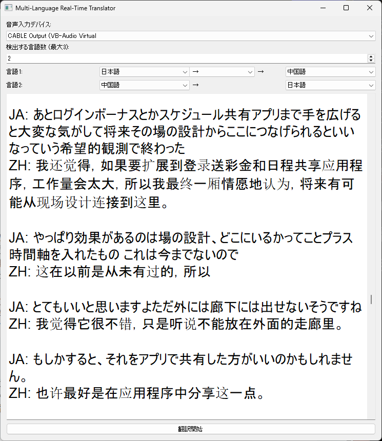

# Voice-Bridge

リアルタイム音声認識・翻訳を行うアプリです．  
日本語・中国語・英語など複数の言語を同時に認識し，自動で翻訳先を振り分けます．

## 主な機能

- 多言語の同時認識
- 言語ごとの翻訳先指定（例：日本語→中国語，中国語→英語）
- Faster-Whisper による高精度な音声認識
- DeepLによる翻訳
- Ctrl + ホイールでフォントサイズ変更

## 🖼️ スクリーンショット


---

## インストール

### 1. リポジトリをクローン

```bash
git clone https://github.com/papirosuke/Voice-Bridge.git
```

### 2. 仮想環境（推奨）

```bash
python -m venv venv
source venv/bin/activate
```

### 3. ライブラリのインストール

```bash
pip install -r requirements.txt
```

### 4.使用方法

```bash
python main.py
```
